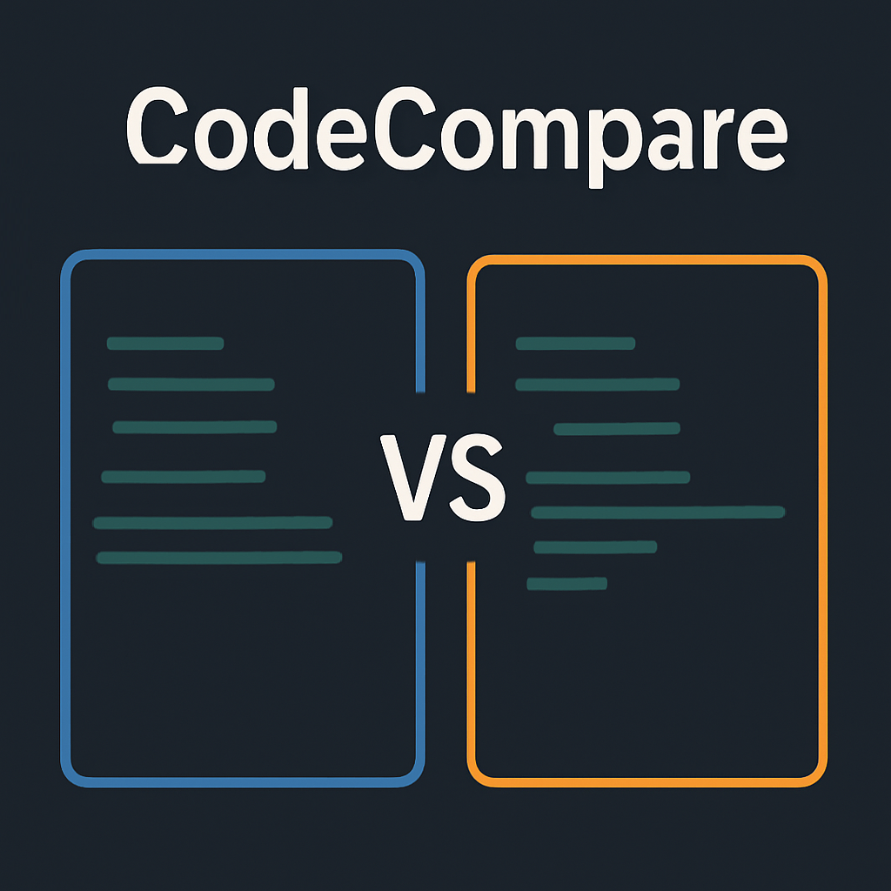

# CodeCompare



**Status:** Finished  
**Author:** Protoncracker  
**Version:** 1.0  
**Last Updated:** 2025-04-14

---

## Overview

**CodeCompare** is a command-line tool for comparing the execution speed of two Python code snippets or files. It provides deterministic, statistically robust benchmarking, clear reporting, and exportable results. Designed for Python developers and technical teams, it enables reproducible microbenchmarks and helps make informed optimization decisions.

---

## ⚠️ Disclaimer & Vision

While CodeCompare uses robust statistical methods to compare Python code snippets, **it does not guarantee 100% accurate or absolute timing results**. Actual performance can vary due to factors such as processor architecture, operating system, background processes, and hardware differences. This tool is intended as a best-effort, Python-only solution for relative benchmarking in controlled environments.

*This is my attempt at providing a practical and statistically sound approach for Python code comparison. My hope is that, in the future, we will be able to create tools capable of comparing any code to any other code, regardless of language, with high accuracy and reliability. For now, CodeCompare represents the best method I know for Python microbenchmarking.* ~protoncracker.

---

## Features

- **Compare two Python code snippets or files for execution speed**
- **Deterministic benchmarking** (fixed random seed for reproducibility)
- **Statistical analysis**: mean, stdev, percentiles, confidence intervals
- **Custom setup code** (e.g., imports, shared variables)
- **Warm-up runs** to stabilize timing
- **Colored terminal output** and progress bar (can be disabled)
- **Export results and logs** (JSON format, all measurements and stats)
- **Handles errors gracefully** (invalid code, missing files, etc.)

---

## Installation

1. **Clone the repository:**
   ```sh
   git clone https://github.com/yourusername/CodeCompare.git
   cd CodeCompare
   ```

2. **(Optional) Create a virtual environment:**
   ```sh
   python -m venv venv
   source venv/bin/activate  # On Windows: venv\Scripts\activate
   ```

3. **Install dependencies:**
   - Only standard Python libraries are required.
   - For enhanced system info, install `psutil` (optional):
     ```sh
     pip install psutil
     ```

---

## Usage

Run from the command line:

```sh
python main.py [options]
```

### Options

| Option                | Description                                                                                  |
|-----------------------|----------------------------------------------------------------------------------------------|
| `-f1`, `--file1`      | Path to the first Python code file (uses default snippet if omitted)                         |
| `-f2`, `--file2`      | Path to the second Python code file (uses default snippet if omitted)                        |
| `-r`, `--reps`        | Number of repetitions for timing each snippet (default: 20000)                               |
| `-n`, `--num`         | Number of executions per repetition (default: 3)                                             |
| `--setup`             | Path to a file containing custom setup code (e.g., imports)                                  |
| `--no-color`          | Disable colored terminal output                                                              |
| `--warmup`            | Number of warm-up runs before timing (default: 5)                                            |
| `--export-json`       | Export detailed results and statistics to a JSON file                                        |

**Example:**

```sh
python main.py -f1 my_code1.py -f2 my_code2.py -r 10000 -n 5 --setup setup.py --export-json results.json
```

---

## Output

- **Terminal:**  
  - Colored summary of timing statistics, confidence intervals, and relative performance.
  - Progress bar during benchmarking.

- **Files:**  
  - All results and logs are saved in the `outputs/` directory.
  - JSON log includes all measurements, statistics, environment info, and parameters.

---

## Recommended Benchmarking Parameters

```
+---------------+------------------------+--------------------+
| Code Duration | Recommended Repetitions| Executions per Rep |
+---------------+------------------------+--------------------+
|   < 10 μs     |   50,000 – 100,000     |      5 – 10        |
|  10–100 μs    |   10,000 – 50,000      |      3 – 10        |
|  0.1–1 ms     |   5,000 – 10,000       |      3 – 5         |
|   > 1 ms      |   1,000 – 5,000        |      1 – 3         |
+---------------+------------------------+--------------------+
```

---

## Example

Suppose you have two files, `fast.py` and `slow.py`, and an optional `setup.py` for shared imports:

- `fast.py`:
  ```python
  sum([i for i in range(100)])
  ```
- `slow.py`:
  ```python
  sum([i*i for i in range(1000)])
  ```
- `setup.py`:
  ```python
  # Any imports or setup code needed for both snippets
  ```

Run:

```sh
python main.py -f1 fast.py -f2 slow.py --setup setup.py --export-json compare_results.json
```

---

## Project Intent

See [`INTENT.iblueprint`](./INTENT.iblueprint) for a detailed statement of project goals, scope, and design rationale.

---

## License

**Proprietary.**  
© 2025 Protoncracker. All rights reserved.

---

## Author

Protoncracker  
[GitHub: /Protoncracker](https://github.com/Protoncracker)

---

## Acknowledgments

- Inspired by best practices in benchmarking and early-stage documentation (see [IntentBlueprint](https://github.com/Protoncracker/IntentBlueprint)).
- Uses only standard Python libraries for maximum portability.

---

